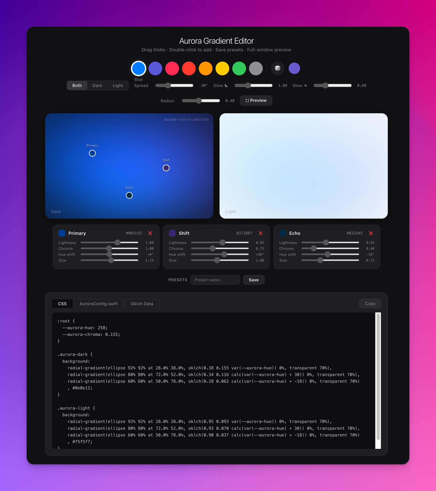

# Aurora Gradient Editor

Visual editor for creating app background gradients using gaussian color blobs. All colors are computed from a single base accent color using the **Oklch** perceptually uniform color space.

**[→ Open Editor](https://a-bashtannik.github.io/aurora-gradient-editor/)**



## How it works

Each blob stores a recipe — hue shift, chroma multiplier, lightness multiplier, and size — relative to the base color. When you switch the base (e.g. Blue → Green), all blobs recompute their colors while preserving the same visual harmony.

The math:

```
H = baseHue + hueShift
C = min(0.37, baseChroma × chromaMul × glow)
L = isDark ? (0.10 + lightMul × 0.28) : (0.82 + lightMul × 0.13)
```

Oklch guarantees equal ΔL = equal perceived brightness change regardless of hue.

## Features

- **Apple accent colors** — Blue, Purple, Pink, Red, Orange, Yellow, Green, Gray + random/custom
- **Drag** blob positions on canvas, **double-click** to add new blobs
- **Per-blob controls** — lightness, chroma, hue shift, size
- **Separate dark/light glow** — light backgrounds need less chroma to look equally vivid
- **Full-window preview** — dark and light mode
- **Save/load presets** — localStorage
- **Export** — CSS (`oklch()` with `calc(var(--aurora-hue) + shift)`), SwiftUI (`AuroraConfig.swift`), raw Oklch data

## Export formats

**CSS** — uses CSS custom properties, change `--aurora-hue` to recolor everything:

```css
:root {
  --aurora-hue: 258;
  --aurora-chroma: 0.155;
}
```

**SwiftUI** — generates `AuroraConfig` struct with blob recipes that resolve at runtime from `baseHue` + `colorScheme`:

```swift
struct AuroraConfig {
    static let glowDark: Double = 1.00
    static let glowLight: Double = 0.60
    static let baseRadius: Double = 0.40

    static let recipes: [AuroraBlobRecipe] = [
        AuroraBlobRecipe(cx: 0.280, cy: 0.380, hueShift: 0.0, chromaMul: 1.00, lightMul: 1.00, sizeMul: 1.15),
        AuroraBlobRecipe(cx: 0.720, cy: 0.520, hueShift: 30.0, chromaMul: 0.75, lightMul: 0.85, sizeMul: 1.00),
    ]
}
```

## Setup

No build step. Single HTML file.

```bash
git clone https://github.com/a-bashtannik/aurora-gradient-editor.git
open index.html
```

## License

MIT